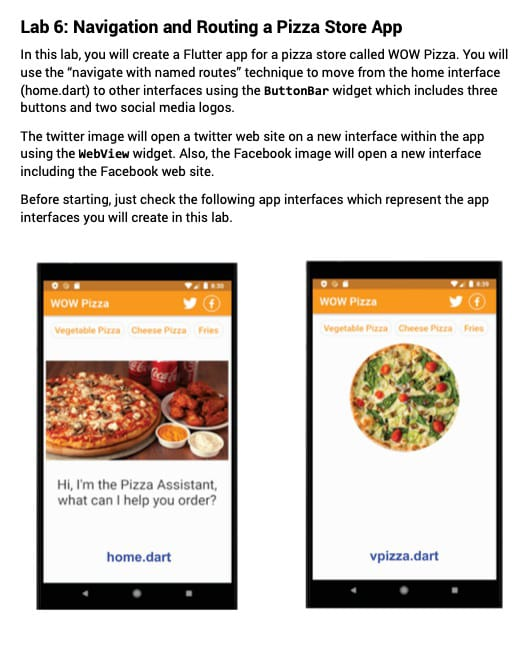
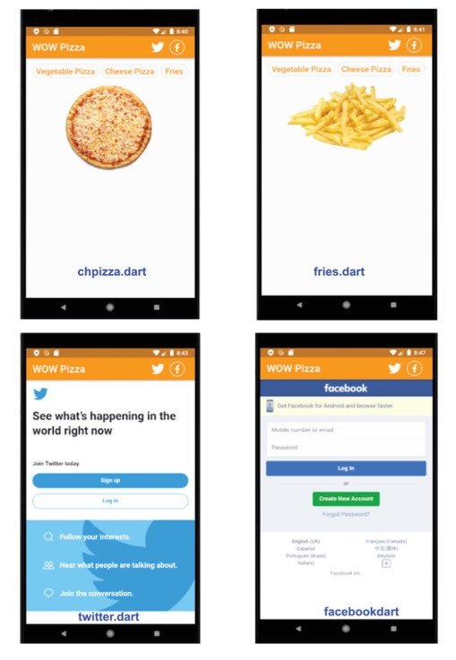

# UN WOMEN - FLUTTER Basic

This is training *Flutter Development Course* implemented by the **Egyptian Council**, and this activity comes within the framework of the joint regional program between **UN Women Egypt** and the **International Labor Organization ILO Cairo** “Promoting productive employment and decent work for women in Egypt, Jordan, and Palestine” and the UN Women’s “Economic Empowerment of Women in Egypt” program.

These programs *Flutter Development Course* are implemented in partnership with the **Ministry of International Cooperation**, the **Egyptian Ministry of Labor**, and the **National Council for Women**, with support from the **Swedish International Development Cooperation Agency (SIDA)** and the **Korea International Cooperation Agency**.

## Tasks

This project is a collection of mini-projects throughout the *first 14 sessions* of training, and these mini-projects are represented as a *day folder* in lib.

You can see notes in each of these mini-projects.

Here you can see the tasks and a short description:
| Task        | Description |
| ------------- | ------------- |
| Task 1 | [Report about JIT Vs AOT](https://drive.google.com/file/d/1OoLIAwxQkiHyTRPPE8QTzO0D9gLUtBXZ/view?usp=drive_link) |
| [Task 2](lib/day002)  | Example 1 checks the weight. Example 2 uses a switch case to check the value of the variable day. [Report about Const Vs Final](https://drive.google.com/drive/folders/1OtpXo1zeaIVSPcfso-JdgUcmVnO0DF1A?usp=drive_link)  |
| [Task 3](lib/day003)  | Make ATM services application with these options: 1. check balance 2. withdraw cash 3. deposit cash 4. quite |
| [Task 4](lib/day004)  | Created a dart application that contains a Product class that has properties (name, price, and barcode) and then created a list of 7 products with different prices and then created a function to calculate the total price. and [Report about List, Set, and Map.](https://drive.google.com/file/d/1PJKFTp_WVc6yA8zc_Rdw_7mTVs4Lbrq-/view?usp=drive_link) |
| [Task 5](lib/day005)  | Create Dart application that consists of three classes. The parent class is the Car class, which consists of 3 parameters (color  required, manufacture year optional, motor speed optional)  and has two functions showMotorSpeed, and car info ... create two classes which are inherited from the Car class. demonstrate concepts of (override, this, super, forward constructor)  |
| [Task 6](lib/day006)  |  |
| [Task 7](lib/day007/task)  |  |
| [Task 8](lib/day008)  |   |
| [Task 9](lib/day009/task)  |  |
| [Task 10](lib/day010/task)  | Created a simple app to store employee names and show them using `sqlfite` package |
| [Task 11](lib/day011/task)  | Content Cell  |
| [Task 12](lib/nilu_app)  | Content Cell  |
| [Task 13](lib/nilu_app/pages/client)  | Content Cell  |
| [Task 14](lib/nilu_app/pages/product)  | [Report about foreign_keys and how to use in SQLite](https://drive.google.com/file/d/15ihFpR0X1mSrftnfSKOMEN4aLcv_Ed7x/view?usp=sharing)  |

A few resources to get you started if this is your first Flutter project:

- [Lab: Write your first Flutter app](https://docs.flutter.dev/get-started/codelab)
- [Cookbook: Useful Flutter samples](https://docs.flutter.dev/cookbook)

For help getting started with Flutter development, view the
[online documentation](https://docs.flutter.dev/), which offers tutorials,
samples, guidance on mobile development, and a full API reference.
